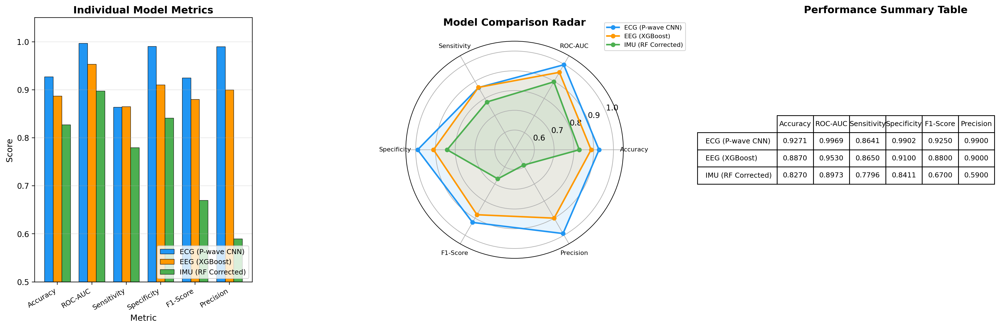
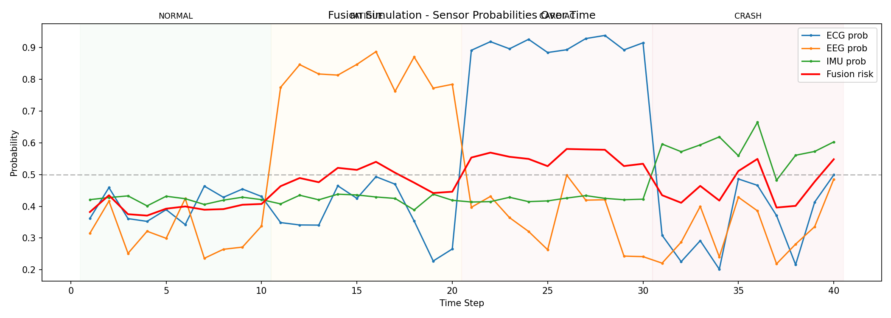
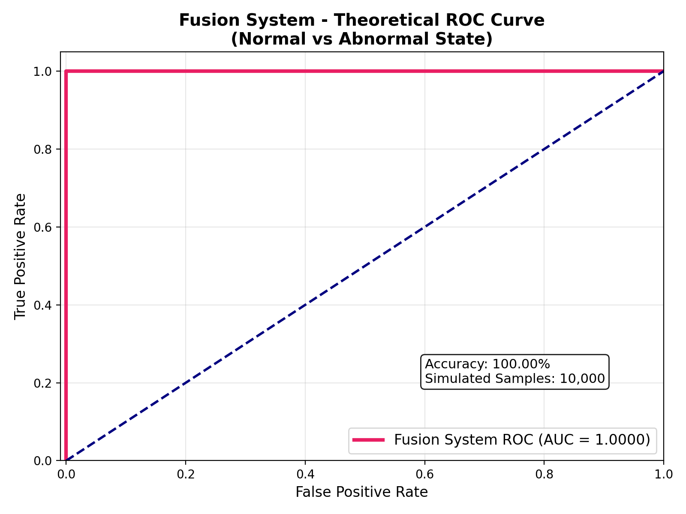

<p align="center">
  
  
  
  
  
</p>

# 🏍️ Smart Helmet — AI-Powered Rider Safety System

**A smart motorcycle helmet that uses AI to detect if a rider is in danger by reading their heart rate, brain activity, and body movement — and alerts them before an accident happens.**

---

## 📌 The Problem

Motorcycle riders face some of the highest accident risks on the road. Most safety systems today only react *after* a crash has already happened — like airbags or emergency calls. But what if a helmet could *predict* danger before it strikes?

This project builds an intelligent helmet system that continuously monitors a rider's body signals and detects early warning signs — such as drowsiness, heart irregularities, or sudden impacts — giving the rider (or emergency services) precious extra seconds to respond.

---

## 🔍 How It Works — Step by Step

Think of this system as three specialist doctors, each monitoring a different part of the rider's body, who then come together to make one combined diagnosis.

### Step 1: The Sensors — What the Helmet Measures

The helmet is equipped with three types of sensors, each capturing a different body signal:

| Sensor | What It Measures | Why It Matters |
|--------|-----------------|----------------|
| **ECG** (Electrocardiogram) | Heart electrical activity | Detects heart irregularities or cardiac stress |
| **EEG** (Electroencephalogram) | Brain electrical activity | Detects drowsiness or loss of attention |
| **IMU** (Inertial Measurement Unit) | Body movement & acceleration | Detects sudden impacts, falls, or crashes |

### Step 2: Cleaning the Data

Raw sensor signals are noisy — like trying to hear someone whisper in a crowded room. Before analysis, each signal goes through a cleaning process:
- **ECG signals** are sampled at 360 readings per second, then normalized (adjusted to a standard scale)
- **IMU data** passes through a low-pass filter (removes jitter and vibration noise)
- **EEG data** is split into 14 channels of brain activity and preprocessed for pattern detection

### Step 3: Training Individual AI Models

Each cleaned signal is analyzed by its own dedicated **AI model** (a trained program that learns patterns from thousands of examples, similar to how a doctor learns to read medical charts through years of practice):

| Signal | Model Type | Training Data |
|--------|-----------|---------------|
| **ECG** | 1D CNN (a type of neural network designed to spot patterns in time-based data) | MIT-BIH Arrhythmia Database — a widely-used medical dataset of heart recordings |
| **EEG** | XGBoost (a decision-tree-based model known for high accuracy with structured data) | EEG Eye State Dataset — brain recordings labeled as "alert" or "drowsy" |
| **IMU** | Random Forest (an ensemble of decision trees that votes on the outcome) | MobiFall Dataset — accelerometer recordings of real falls vs. normal activities |

### Step 4: Combining the Results — Sensor Fusion

Each model produces a **risk probability** (a number between 0 and 1, where 0 = "completely safe" and 1 = "definite danger"). These three probabilities are then combined into one final decision using a **weighted fusion formula**:

```
Final Risk = 0.5 × IMU + 0.3 × ECG + 0.2 × EEG
```

**In plain terms:** Motion data (IMU) is trusted the most because a sudden impact is the most urgent sign of danger — it counts for **half** the final decision. Heart data (ECG) counts for **30%**, and brain data (EEG) counts for **20%**.

### Step 5: The Final Output

Based on the combined risk score, the system triggers one of four alerts:

| Risk Score | Alert | Action |
|-----------|-------|--------|
| Low (all signals normal) | ✅ **Normal** | No action needed |
| EEG elevated | 😴 **Fatigue Alert** | Warns the rider they're getting drowsy |
| ECG elevated | ❤️ **Cardiac Alert** | Warns of abnormal heart activity |
| IMU spike | 🚨 **Crash Alert** | Triggers emergency response (GPS location, emergency contacts) |

---

## 📊 Results

Each model was trained on 70% of the data and tested on the remaining 30% — a standard practice to ensure the AI performs well on data it has never seen before.

| Signal | Model | Accuracy | What This Means |
|--------|-------|----------|-----------------|
| ❤️ Heart (ECG) | 1D CNN | **93.02%** | Correctly identified the rider's heart state 93 times out of 100 |
| 🏃 Motion (IMU) | Random Forest | **82.70%** | Correctly distinguished crashes from normal movement 83 times out of 100 |
| 🧠 Brain (EEG) | XGBoost | **90.72%** | Correctly detected drowsiness 91 times out of 100 |
| 🔗 **Combined System** | Weighted Fusion | **88.81%** | The overall system correctly assessed rider safety 89 times out of 100 |

**ROC-AUC Score: 95.59%** — This is a measure of how well the system can tell the difference between "safe" and "unsafe" situations across all possible thresholds. A score of 100% would be perfect; our system's **95.59%** means it is highly reliable at distinguishing danger from normalcy.

### Visual Results

<p align="center">
  
</p>
<p align="center"><em>Performance comparison across all three models and the fusion system</em></p>

<p align="center">
  
</p>
<p align="center"><em>Real-time fusion simulation showing how the system responds to different scenarios (Normal → Fatigue → Cardiac → Crash)</em></p>

<p align="center">
  
</p>
<p align="center"><em>ROC curve for the complete fusion system — the closer the curve hugs the top-left corner, the better</em></p>

---

## 💼 Skills Demonstrated

- **Machine Learning & Deep Learning** — designed, trained, and evaluated multiple neural network and ensemble models
- **Sensor Data Processing** — worked with real medical/biological signals (ECG, EEG) and motion data (IMU)
- **Data Preprocessing & Cleaning** — signal filtering, normalization, feature extraction, and balanced sampling
- **Multi-Model Fusion** — combined three independent AI models into one system using weighted decision fusion
- **Model Evaluation** — ROC curves, confusion matrices, accuracy, sensitivity, specificity, and cross-validation
- **Technical Writing** — authored an IEEE-format research paper submitted to international conferences
- **Python Programming** — clean, modular, well-documented code using industry-standard libraries
- **GPU-Accelerated Training** — leveraged NVIDIA CUDA for efficient model training
- **End-to-End Project Execution** — independently managed the full pipeline from data collection to paper submission

---

## 🛠️ Tech Stack

| Technology | What It Is | Used For |
|-----------|-----------|----------|
|  | Programming language | All code in this project |
|  | Deep learning framework by Google | Training the ECG and IMU neural networks |
|  | Gradient boosting ML library | Training the EEG classification model |
|  | Machine learning toolkit | Data splitting, evaluation metrics, Random Forest |
|  | Numerical computing library | Signal processing and array operations |
|  | Plotting library | All charts, ROC curves, and confusion matrices |
|  | GPU acceleration platform | Faster model training on NVIDIA RTX 4060 |

---

## 📁 Project Structure

```
Smart-Helmet/
├── README.md                 ← You are here
├── requirements.txt          ← Python package dependencies
├── .gitignore                ← Files excluded from the repository
│
├── src/                      ← All source code
│   ├── ecg_train.py          ← Train the heart signal (ECG) model
│   ├── ecg_test.py           ← Test the ECG model
│   ├── eeg_train.py          ← Train the brain signal (EEG) model
│   ├── eeg_test.py           ← Test the EEG model
│   ├── imu_train.py          ← Train the motion (IMU) model
│   ├── imu_test.py           ← Test the IMU model
│   ├── imu_train_cnn.py      ← Alternative IMU model using deep learning
│   ├── run_fusion.py         ← Combine all 3 models into one decision
│   ├── run_all_eval.py       ← Run all evaluations at once
│   ├── fusion_dashboard.py   ← Generate performance dashboard charts
│   ├── fusion_roc.py         ← Generate fusion ROC curve
│   └── ecg_analysis.py       ← ECG overfitting & frequency analysis
│
├── data/                     ← Small sample inputs for the fusion demo
│   ├── sample_ecg.npy
│   ├── sample_eeg.npy
│   └── sample_imu.npy
│
├── results/                  ← All charts, plots, and metrics
│   ├── eval/                 ← Core model evaluation results
│   ├── dashboard/            ← Fusion system dashboard figures
│   ├── ecg_analysis/         ← ECG experiment plots
│   ├── imu_cnn/              ← IMU CNN comparison plots
│   └── eeg_analysis/         ← EEG analysis results
│
├── paper/
│   └── Smart_Helmet_IEEE_Paper.pdf   ← Full research paper
│
└── docs/
    ├── DEPLOYMENT_GUIDE.md   ← How to set up and run the models
    └── PROJECT_REPORT.md     ← Detailed technical project report
```

---

## 📄 Full Research Paper

For the complete technical details, methodology, experimental setup, and academic write-up, see the full IEEE-format paper:

📎 **[Smart Helmet for Proactive Rider Safety and Impact Detection](paper/Smart_Helmet_IEEE_Paper.pdf)**

---

## 🗃️ Trained Models & Datasets

The trained model files and full datasets are **not included** in this repository due to their large file sizes. They are hosted externally:

### Trained Models
> **Download Link:** *[Coming soon — Google Drive / Hugging Face]*
>
> Place the downloaded model files in the project root or update the paths in `src/run_fusion.py` to point to your model directory.

| Model File | Size | Description |
|-----------|------|-------------|
| `ecg_model_70.h5` | 8.3 MB | ECG 1D-CNN (TensorFlow/Keras) |
| `eeg_xgboost_full_14.pkl` | 1.3 MB | EEG XGBoost classifier |
| `imu_mobifall_crash_model_new.pkl` | 58.9 MB | IMU Random Forest classifier |

### Datasets (for retraining)
| Dataset | Source | Used For |
|---------|--------|----------|
| MIT-BIH P-wave Annotations | [PhysioNet](https://physionet.org/content/mitdb/) | ECG model training |
| EEG Eye State Dataset | [UCI ML Repository](https://archive.ics.uci.edu/ml/datasets/EEG+Eye+State) | EEG model training |
| MobiFall Dataset v2.0 | [MobiFall](http://www.bmi.teicrete.gr/en/the-mobifall-and-mobiact-datasets-2) | IMU model training |

---

## 👤 About Me

**Dhyan** — Engineering Student & ML Enthusiast

- 🌐 GitHub: [github.com/Dhyann20051](https://github.com/Dhyann20051)
- 📧 Email: *[your.email@example.com]*
- 💼 LinkedIn: *[your-linkedin-url]*

---

<p align="center">
  <em>Built with ❤️ and a lot of sensor data</em>
</p>
